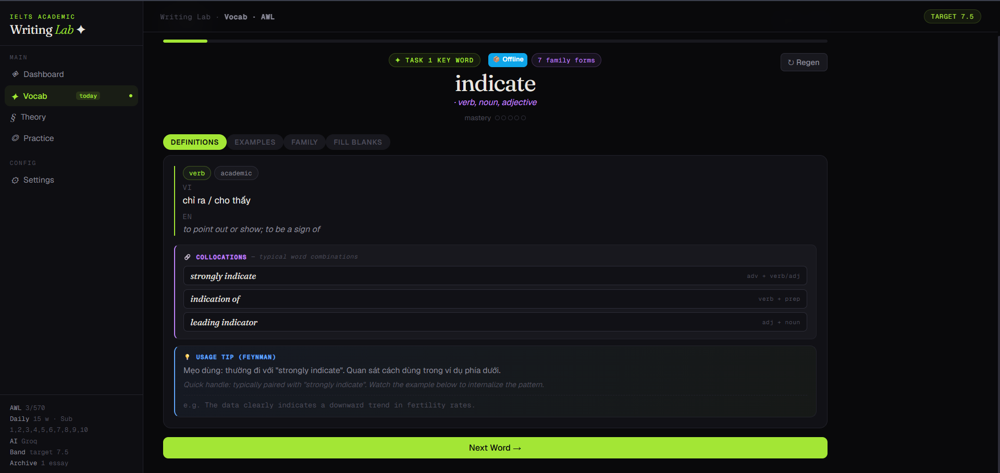
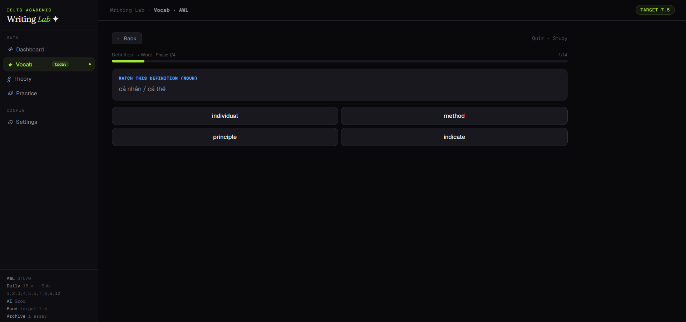
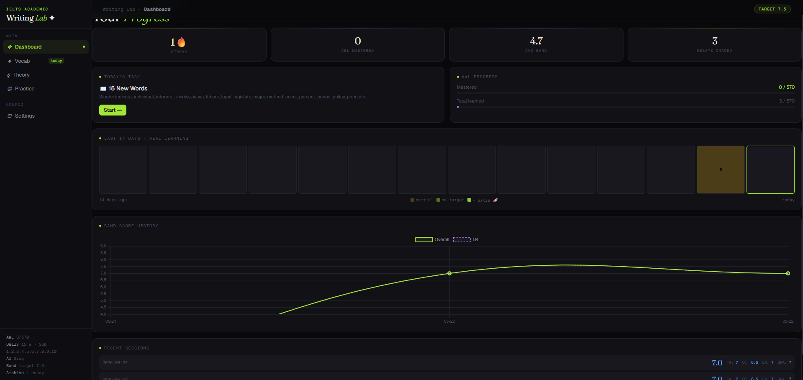
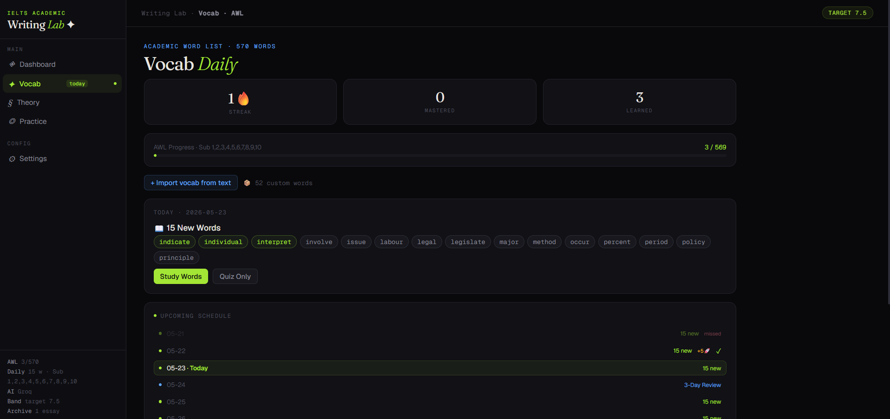

# IELTS Writing Lab ✦

> An offline-first, AI-powered IELTS Academic Writing Task 1 trainer with built-in AWL vocabulary system, Feynman-method coaching, and spaced revision.

<p align="center">
  
  
  
  
  
</p>

---

## 🎯 Project này là gì?

**IELTS Writing Lab** là một công cụ luyện thi IELTS Academic Writing Task 1 hoàn chỉnh, chạy trong một file HTML duy nhất — không cần server, không cần install, mở browser là dùng.

**Link truy cập bản web** https://william-rowan-waltor.github.io/ielts-writing-lab-v7-split/

Khác với các app IELTS thông thường chỉ làm **1 chuyện** (vocab flashcard, hoặc essay grader), Lab này tạo ra **vòng lặp học khép kín**:

```
📚 Học AWL từ vựng  →  ✍️ Viết bài luyện tập  →  🤖 AI chấm + highlight từng câu
        ↑                                                      ↓
        └──── 💡 Word Debt: gợi từ đã học chưa dùng ←──────────┘
              🔁 Revision Queue: viết lại sau 7 ngày
```

Phù hợp cho:
- Học viên đang luyện IELTS Writing band 6.0 → 7.5
- Giáo viên IELTS cần công cụ track tiến độ học viên
- Người tự học muốn có hệ thống bài bản thay vì "viết đại rồi tra Google"

---

## ✨ Tính năng chính

### 1. 📚 AWL Vocabulary System — 570 từ học thuật

Toàn bộ **Academic Word List** được pre-bake offline với:

- **Definition đa lớp**: VI (tiếng Việt) + EN (English) cho mỗi từ
- **Family words với nghĩa riêng từng form**: vd `define / defined / defining / definition / definitive / definitely` — mỗi từ một nghĩa, không phải copy-paste headword
- **Collocations** kèm pattern hint: `clearly define` (adv + verb), `sharp increase` (adj + noun)
- **5-strategy meaning cascade**: SELF → MANUAL gloss → CROSS-lookup (cho false friends như `definite`) → MORPHOLOGY → TEMPLATE
- **Spaced repetition schedule**: 3-day review + 7-day review tự động xen kẽ
- **Custom vocab import**: paste text bất kỳ → AI extract từ vựng → add vào pack riêng

### 2. 🎓 Quiz Mode — 4 Phase Progressive

| Phase | Loại câu | Mục đích |
|---|---|---|
| 1 | **Definition → Word** (MC) | Recognition |
| 2 | **Type the family form** (Fill blank) | Production |
| 3 | **Pick the correct form** (MC) | Word-class awareness |
| 4 | **Collocation cloze** (MC) | Natural pairing — LR score booster |

Quiz tự động skip phase nếu data không đủ. Progress bar phản ánh chính xác số câu thực có.

### 3. ✍️ Practice — Generate + Write + Grade

- **AI generate exam-style prompts**: bar/line/pie/table/map/process diagrams
- **Hoặc paste đề riêng** của bạn
- **Word counter** real-time + warning nếu < 150 words
- **AI Grading theo IELTS Band Descriptors May 2023**: 4 criteria (TA / CC / LR / GRA) + overall band

### 4. 🔬 Sentence-level Feedback (V6)

Sau khi chấm, AI highlight từng câu trong bài với 3 màu:

- 🟢 **Strong** — câu dùng từ chuẩn, cấu trúc tốt
- 🟡 **Improve** — câu ok nhưng có thể nâng cấp
- 🔴 **Error** — câu sai (grammar, lexis, hoặc ngữ pháp)

Hover vào highlight để xem comment cụ thể: *"precise data verb"*, *"subject-verb disagreement: data is plural"*, etc.

### 5. 💡 Word Debt Tracker (V6)

Sau khi chấm bài, AI quét vocabulary user đã master (M ≥ 2) và tìm những từ **đúng chủ đề** mà bài chưa dùng:

> 💡 Bài về biểu đồ dân số → gợi `urban`, `decline`, `proportion` (đã biết nhưng quên dùng)
> Không gợi `consist`, `theory` (đã biết nhưng lạc đề)

1-click để add vào **Priority Queue** → drill ngay trong Vocab tab.

### 6. 🔁 Revision Queue (V6)

Mọi essay đã chấm tự động lên lịch revisit sau 7 ngày. Đến hạn:

- Dashboard hiển thị badge `🔁 N due`
- Click **"Revisit (blind)"** → editor trống, chỉ có prompt cũ
- Viết bài mới từ đầu → AI chấm → **so sánh band old vs new** với delta từng criterion

Đây là kỹ thuật giáo viên IELTS bản ngữ dạy: **viết lại đúng đề** quan trọng hơn viết nhiều đề khác nhau.

### 7. 📊 Dashboard — Tracking thật

- **14-day learning heatmap**: màu theo số từ thực học mỗi ngày (vàng = partial, xanh = on target, xanh đậm = vượt 🚀)
- **Streak counter** (DST-safe)
- **Band history chart** với 4 criteria
- **Avg band** từ 5 bài gần nhất
- **Revision Queue summary** + Upcoming revisits

### 8. 🚀 Continue Learning Past Daily Limit (V5)

Hoàn thành 3 từ/ngày? OK. App vẫn cho bạn:

- Học thêm 3 / 5 / 10 / 15 từ extra
- Track riêng `extra` count trong `dailyStats`
- Heatmap hiển thị badge 🚀 cho ngày vượt target

### 9. 🎨 Personalization

- **3 feedback styles**: Coach (Feynman-style, có analogy) / Direct (terse) / Examiner (formal band descriptor)
- **Writing goal**: set mục tiêu cá nhân → AI reference khi chấm
- **Sublist selection**: chọn AWL Sub 1–10 nào active

---

## 🚀 Bắt đầu sử dụng

### Cách 1: Mở trực tiếp (không AI)

1. Download file `ielts-writing-lab.html`
2. Mở bằng browser (Chrome / Firefox / Safari / Edge)
3. Bắt đầu học từ vựng + làm quiz **offline 100%** — không cần API key

Phần Vocab + Quiz hoạt động hoàn toàn offline với 570 AWL words pre-baked.

### Cách 2: Thêm AI để chấm bài + generate đề

Để dùng **Practice** (chấm bài + sinh đề) và **Word Debt + Sentence Feedback**, cần API key của 1 trong các provider:

- [Anthropic Claude](https://console.anthropic.com/) (recommended)
- [OpenAI GPT-4](https://platform.openai.com/api-keys)
- [Google Gemini](https://aistudio.google.com/app/apikey)
- [DeepSeek](https://platform.deepseek.com/)

Vào **Settings → Add Configuration**, paste API key, chọn model, save.

---

## 📖 Workflow gợi ý

### Cho người mới (Band 5.0 → 6.5)

```
Tuần 1-2:  Học AWL Sublist 1-2 (3 từ/ngày, ~50 ngày)
           Làm quiz mỗi ngày để fix mastery
Tuần 3:    Bắt đầu viết Practice với prompts đơn giản (bar chart)
Tuần 4+:   Mỗi bài chấm xong → check Word Debt → quay lại Vocab drill
```

### Cho người luyện band 7.0+

```
Hằng ngày: 5 từ AWL (vượt target để +🚀 streak)
           1 bài Task 1 timed (20 phút, tự đếm)
Tuần 1-2:  Hoàn thành 10-12 bài chấm
Tuần 3+:   Revision Queue đến hạn — viết lại 5 bài cũ
           So sánh band delta, tìm pattern cải thiện
```

### Cho giáo viên IELTS

- Mỗi học viên có 1 file HTML riêng → progress lưu trong localStorage
- Có thể export essay archive (copy text) để review
- Word Debt Tracker giúp xác định **gap giữa vocab biết và dùng** — insight teaching quan trọng

---

## 🛠️ Technical Architecture

### Stack

- **Frontend only**: React 18 + Babel Standalone (loaded từ CDN, no build step)
- **Single HTML file**: ~480KB bao gồm UI, logic, và 570 AWL entries pre-baked
- **State**: localStorage (key: `ieltsLabState`)
- **AI**: pluggable provider system — Anthropic, OpenAI, Gemini, DeepSeek

### Pre-baked AWL Data Pipeline

```
AWL_DATA (569 entries)
  ↓
AWL_DATA_MAP (Map<headword, entry>)          ← O(1) lookup
AWL_FORM_TO_HW (4103 forms → headword)        ← 2-pass: HW priority then family
COLLOC_DISTRACTOR_POOL (~2200 forms × 4 POS) ← Quiz distractors
FAMILY_GLOSS (76 hand-crafted definitions)    ← Override morphology fallback
EN_GLOSS (69 plain-English glosses)           ← Anti-circular definitions
```

### V6 Schema Changes

| Field | Type | Purpose |
|---|---|---|
| `essays[].revisitDue` | timestamp | When to suggest revisit (savedAt + 7 days) |
| `essays[].revisitedAt` | ISO date | Marker when user has done revisit |
| `essays[].revisitedFromId` | string | Link from child revisit → parent essay |
| `gradeResult.annotations` | `[{sentence, tag, comment}]` | Per-sentence feedback |
| `gradeResult.topicRelevantUnusedAWL` | `[{word, reason}]` | Word Debt items |
| `dailyStats[date]` | `{target, extra, words}` | Real progress per day |

### Caching Strategy

- **Word data**: cached per word in `state.wordCache[word]`
- **Cache version**: bumped on schema change (currently v7) → auto-migrates old data
- **Pre-baked data**: instant load, no API call needed for Sub 1-10 words

---

## 🎨 Screenshots

> *(Thêm screenshots vào folder `/docs` và link ở đây)*

| Vocab Daily | Quiz Phase 4 (Collocation) | Sentence Feedback |
|---|---|---|
|  |  |  |

| Dashboard with Heatmap | Word Debt Panel | Revision Comparison |
|---|---|---|
|  |  |  |

---

## ⚙️ Customization

### Thay đổi số từ mỗi ngày

Settings → Words per day: 3 / 5 / 7 / 10 / 15 / 20

### Active Sublists

Mặc định active 10 sublist. Có thể chọn riêng (vd chỉ Sub 1-3 để focus base vocab) trong Vocab tab → Settings panel.

### Feedback Style

Settings → Feedback Style:
- **Coach** (default): friendly, analogy-rich, explain *why*
- **Direct**: terse, no praise filler, 5-10 word criticisms
- **Examiner**: formal IELTS descriptor language

### Add Custom Words

Vocab tab → "+ Import vocab from text" → paste paragraph/article → AI extracts new words → review → add to custom pack. Custom words quiz được test cùng AWL.

---

## 🔒 Privacy & Data

- **Toàn bộ data lưu trong browser localStorage** — không server
- **API calls**: chỉ gửi request đến provider bạn config (Anthropic/OpenAI/...), không qua server trung gian
- **Export**: copy state JSON từ Settings để backup hoặc share
- **Reset**: Settings → Reset Vocab Progress (only) hoặc clear localStorage để xóa toàn bộ

---

## 🐛 Known Limitations

| Limitation | Workaround |
|---|---|
| AWL pre-bake chỉ 570 từ Coxhead's list | Dùng Custom Vocab import cho từ ngoài AWL |
| Cần API key cho Practice/Grading | Vocab + Quiz hoàn toàn offline được |
| Collocation cloze chỉ generate được ~89% entries | Phase 4 graceful fallback nếu data thiếu |
| Single-user (localStorage) | Mỗi user 1 file HTML riêng |

---

## 🗺️ Roadmap

### V8 — đang cân nhắc

- [ ] Sentence Stems Library (trend / data / comparison language)
- [ ] Band Trajectory Forecast (linear regression on last 10 essays)
- [ ] Timed Writing Mode (20-min countdown)
- [ ] Audio pronunciation (TTS API)

### Có thể có

- [ ] PWA (installable, full offline)
- [ ] Peer Comparison (share key)
- [ ] Paraphrase Drills (Band 5 → Band 7)

---

## 📜 Changelog

### V7 (May 2026) — Collocation Quiz
- Added Phase 4 collocation cloze with smart POS detection
- 4-gate quality filter (stopword / length / family / POS confidence)
- 89% coverage on real AWL entries

### V6 — Vocab-Writing Bridge
- Word Debt Tracker (topic-relevant unused vocab)
- Revision Queue (7-day spaced revisit)
- Sentence-level annotations with hover comments

### V5 — Real Progress Tracking
- `dailyStats` schema for real per-day learning
- Continue learning past daily limit (extra sessions)
- 14-day learning heatmap on dashboard
- DST-safe streak calculation, multiple UI bug fixes

### V4 — Reverse Index + Custom Vocab
- `AWL_FORM_TO_HW` reverse index for accurate essay extraction
- Custom vocab import workflow
- Personal writing goal + feedback style preferences
- Local timezone fix (was UTC, broke for UTC+7 users)

### V3 — Family Meanings System
- 5-strategy meaning cascade (SELF / MANUAL / CROSS / MORPHOLOGY / TEMPLATE)
- 76 hand-crafted family glosses
- 69 EN definitions for top AWL words

---

## 🤝 Contributing

Project này được build bằng phương pháp incremental — mỗi version giải quyết 1-3 vấn đề cụ thể. Pull requests welcome cho:

- Thêm hand-crafted FAMILY_GLOSS entries (xem `FAMILY_GLOSS` const trong code)
- Thêm EN_GLOSS cho AWL headwords chưa cover
- Tối ưu collocation distractor selection
- UI/UX improvements

---

## 📝 License

MIT License — free để dùng cho cá nhân và thương mại.

---

## 🙏 Acknowledgments

- **AWL (Academic Word List)** by Averil Coxhead — the 570-word backbone
- **IELTS Band Descriptors** (Public version, May 2023) — grading reference
- **React + Babel Standalone** — making single-file SPA possible

---

<p align="center">
  <em>Built for serious IELTS learners who want a real system, not another flashcard app.</em>
</p>
